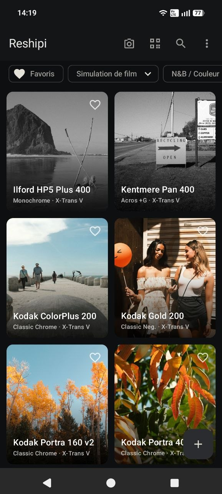
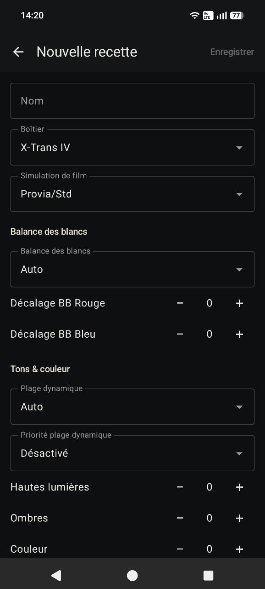
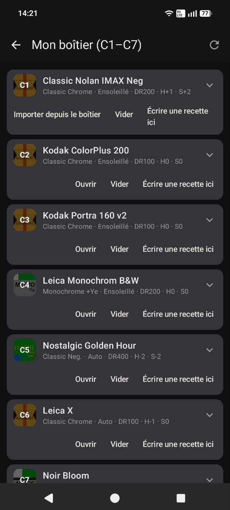
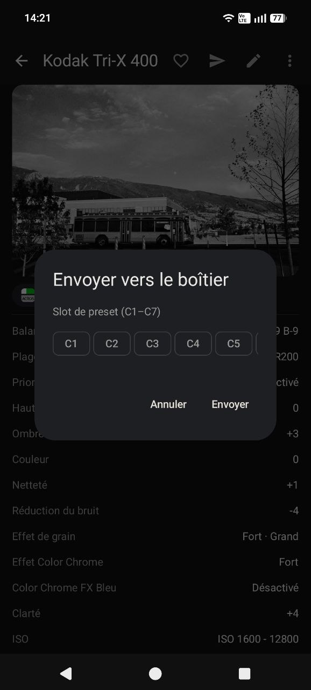

# Reshipi

An Android app for collecting Fujifilm film-simulation recipes — and pushing
them straight into the camera over USB.

Reshipi stores recipes in the style of [Fuji X Weekly](https://fujixweekly.com/):
film simulation, white balance and shifts, tone curve, grain, Color Chrome,
and every other JPEG-engine setting, organised per sensor generation
(X-Trans I → V) so the form only shows what your camera actually has.

| Library | Editing | Camera slots | Send over USB |
|---|---|---|---|
|  |  |  |  |

## Features

**Recipe library**
- Create recipes from scratch, with fields filtered by sensor generation
- Import from pasted text (Fuji X Weekly / FujiStyle card format, English or
  French), from a photo of a recipe card (OCR), from a Fujifilm JPEG's EXIF,
  from a web page URL, or from a QR code
- Search, sort, favourites, tags, and filters (film simulation, camera,
  black & white / colour)
- Duplicate detection: identical settings are flagged at import and save time
- Example photos per recipe, full backup/restore as a ZIP

**Camera over USB (PTP)**
- Read the C1–C7 custom presets from the camera and import them as recipes
- Write a recipe into any C1–C7 slot, with read-back verification, a
  confirmation before overwriting an occupied slot, and an optional dated
  backup of what was there
- Clear a slot back to its neutral, unnamed state
- Preview a recipe by developing a RAF **inside the camera** — the real
  Fujifilm engine, not a simulation
- Export a recipe as a `.cube` LUT, built by developing a synthetic colour
  chart twice (neutral vs. recipe) in the camera

Validated on the **X-T30 III**. Other USB-capable Fujifilm bodies should work
for reading/writing presets — reports welcome.

## Using the USB features

1. Set the camera's USB mode to **RAW CONV./BACKUP RESTORE**
   (`USB RAW CONV./BACKUP RESTORE` in the connection settings).
2. Plug the camera into the phone with a USB cable.
3. Open *My camera (C1–C7)* in the app, or use *Send to camera* from a recipe.

## Building

```sh
./gradlew :app:assembleDebug        # unsigned debug APK
./gradlew :app:testDebugUnitTest    # unit tests
```

Release builds are signed with credentials from a gitignored
`keystore.properties`; without it, release builds are simply unsigned.

Requires JDK 17. No Google services are needed at runtime beyond the
on-device ML Kit text recognition used for OCR import.

## License

[MIT](LICENSE). Third-party code and assets are credited in
[THIRD_PARTY.md](THIRD_PARTY.md).

Reshipi is an unofficial, non-commercial project with no affiliation to
FUJIFILM Corporation. Fujifilm, Provia, Velvia, Astia, Acros, Reala and the
film simulation names are trademarks of FUJIFILM Corporation, used
descriptively.
